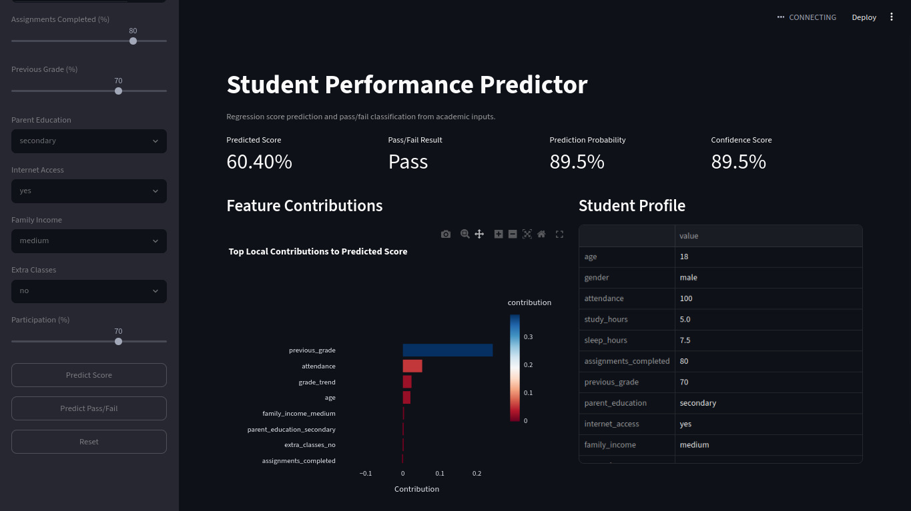

🎓 AI-Driven Student Performance Prediction & Personalized Learning

A full-stack machine-learning platform for prediction, risk analysis, explainability, personalized recommendations, deterministic timetable planning, and academic monitoring.

  
  
  

  
  
  
  
  
  
  

🌟 Project Overview

AI-Driven Student Performance Prediction and Personalized Learning Recommendation Using Machine Learning is an end-to-end academic analytics platform that combines:

🤖 Machine Learning + 🧠 Deterministic Decision Logic + 🔍 Explainable AI + 💬 AI Advisor + 📅 Timetable Planning + 🛡️ Role-Based Web Application

The platform produces two core ML outputs:

Output

Purpose

📈 Regression

Predicts a student's final score on a 0–100 scale

✅ Classification

Predicts pass/fail status and pass probability

These predictions are connected to student profiles, historical daily snapshots, personalized recommendations, a constrained 24-hour study planner, AI academic guidance, faculty analytics, and an administrator portal.

🔗 Quick Links

Resource

Link

🌐 Live Application

ai-prediction-student.vercel.app

⚡ Backend API

student-performance-api-wsh5.onrender.com

📚 Interactive API Docs

/api/docs

💻 GitHub Repository

github.com/puni344/ai-prediction-student

📊 UCI Student Performance Dataset

UCI ML Repository

🧭 System Architecture

flowchart TD
    U["👥 Student / Faculty / Admin"] --> F["⚛️ React + TypeScript + Vite"]
    F -->|"HTTPS / JSON"| B["⚡ FastAPI Backend"]

    B --> M["🤖 ML Prediction Engine"]
    B --> R["🧮 Deterministic Rules & Planning"]
    B --> A["💬 AI Advisor Layer"]

    M --> D["🐘 PostgreSQL"]
    R --> D
    A --> D

    D --> P["📚 Persistent Academic Data"]

    style U fill:#eef2ff,stroke:#6366f1,color:#111827
    style F fill:#e0f2fe,stroke:#0284c7,color:#111827
    style B fill:#ecfdf5,stroke:#10b981,color:#111827
    style M fill:#fff7ed,stroke:#f97316,color:#111827
    style R fill:#fefce8,stroke:#eab308,color:#111827
    style A fill:#f5f3ff,stroke:#8b5cf6,color:#111827
    style D fill:#eff6ff,stroke:#2563eb,color:#111827
    style P fill:#f8fafc,stroke:#64748b,color:#111827

🔐 Architectural Responsibility

The backend owns the authoritative academic numbers.

The AI language layer receives verified backend context and provides natural-language guidance. It does not own:

prediction values

pass probability

risk level

recommendation priority

recommendation duration

timetable times or ordering

🧩 Core Design Principle

ML decides the numbers. Deterministic logic decides structured actions. AI explains and communicates.

🛠️ Technology Stack

🎨 Frontend

Technology

Role

⚛️ React 19

UI

🔷 TypeScript

Typed frontend development

⚡ Vite

Build tooling and dev server

🎨 Tailwind CSS

Styling

🧭 React Router

Client-side routing

📡 Axios

API communication

📊 Recharts

Data visualization

✨ Lucide React

Icons

⚙️ Backend

Technology

Role

🐍 Python

Backend / ML ecosystem

⚡ FastAPI

REST API

✅ Pydantic

Validation and schemas

🗃️ SQLAlchemy

Database access

🚀 Uvicorn

ASGI server

🤖 Machine Learning

Technology

Role

pandas

Data processing

NumPy

Numerical operations

scikit-learn 1.7.2

ML pipelines and evaluation

XGBoost

Benchmark model

CatBoost

Benchmark model

SHAP

TreeSHAP explainability

joblib

Model persistence

🔐 Database & Integrations

🐘 PostgreSQL

🔑 Google Sign-In

📅 Read-only Google Calendar integration

🗓️ Academic calendar integration

🛡️ Cloudflare Turnstile

✉️ Email verification / password reset

💬 Gemini-compatible AI provider path

📊 Dataset

Source

The current benchmark uses the UCI Student Performance dataset, specifically the student-mat.csv mathematics-course records.

Verified Dataset Statistics

Item

Value

📚 Total records

395

🧪 Development records

316

🔒 Untouched test records

79

✂️ Development / test split

80% / 20%

🧱 Total standardized columns

20

🎯 Model input features

18

🔁 Cross-validation folds

5

🎲 Random state

42

✅ Pass threshold

40 / 100

📐 Saved benchmark grade median

52.5

The final training path uses the real UCI dataset strictly. The generic utility layer retains an offline synthetic-data helper for development compatibility, but the final benchmark training path does not use synthetic fallback data.

🧬 Input & Feature Engineering

Source / Academic / Behavioural Inputs

gender
age
study_hours
attendance
sleep_hours
previous_grade
internet_access
parent_education
family_income
extra_classes
assignments_completed
participation

Engineered Features

study_efficiency
homework_ratio
academic_engagement_score
sleep_quality_index
grade_trend
risk_index

Targets

final_score
pass_fail

The standardized schema therefore contains:

18 model features + 2 target fields = 20 standardized columns

🔄 UCI Feature Mapping

The application does not pass raw UCI columns directly into the models. src/utils.py and the feature-engineering layer standardize them into the application schema.

Application Field

Source / Transformation

attendance

Derived from UCI absences

previous_grade

Derived from G1 and G2

final_score

Derived from G3 and converted from 0–20 to 0–100

sleep_hours

Derived from the UCI health field using the deterministic mapping

parent_education

Derived from mother/father education values

assignments_completed

Derived using the project's deterministic formula from failures and absences

participation

Derived from family relationship, free-time, and going-out variables

extra_classes

Derived from paid classes and school-support fields

family_income

Derived using the standardization rules

🧪 Modeling Methodology

The training pipeline follows a controlled sequence:

UCI Dataset
    ↓
Schema Standardization
    ↓
Data Cleaning
    ↓
80/20 Development-Test Split
    ↓
Leakage-Controlled Preprocessing
    ↓
Feature Engineering
    ↓
5-Fold Cross-Validation
    ↓
Model Comparison
    ↓
RandomizedSearchCV Tuning
    ↓
Untouched Test Evaluation
    ↓
Persisted Production Artifacts
    ↓
Verified Inference

🔒 Leakage Control

Learned preprocessing statistics are fitted only on the 316-record development set before the final evaluation on the 79-record untouched test set.

Model selection uses 5-fold cross-validation on development data.

The untouched test set is reserved for final performance evaluation.

🤖 Models Evaluated

Regression

Linear Regression

Decision Tree Regressor

Random Forest Regressor

Gradient Boosting Regressor

XGBoost Regressor

CatBoost Regressor

Tuned Random Forest Regressor

Classification

Logistic Regression

Decision Tree Classifier

Random Forest Classifier

Support Vector Machine

Gradient Boosting Classifier

XGBoost Classifier

CatBoost Classifier

Tuned Random Forest Classifier

🏆 Production Models

The current persisted production inference artifacts are:

models/regression.pkl  →  Tuned Random Forest Regressor
models/classifier.pkl  →  Tuned Random Forest Classifier

Model Selection Criteria

Task

Selection Metric

📈 Regression

5-fold CV RMSE

✅ Classification

5-fold CV F1

Additional Random Forest, XGBoost, and CatBoost artifacts are retained because the runtime also supports model-family comparison in the prediction/results experience.

📈 Verified Holdout Results

The following metrics are recorded in models/metrics.json from the 79-record untouched test set.

📈 Production Regression

Metric

Tuned Random Forest Regressor

MAE

5.6076

MSE

70.5675

RMSE

8.4004

R²

0.8629

Regression Benchmark Comparison

Model

MAE

RMSE

R²

Linear Regression

7.4967

11.0647

0.7622

Decision Tree

6.1392

10.5092

0.7855

Random Forest

5.4359

7.8578

0.8801

Gradient Boosting

5.6486

7.9396

0.8776

XGBoost

5.9499

8.1472

0.8711

CatBoost

5.6474

8.4145

0.8625

Tuned Random Forest

5.6076

8.4004

0.8629

✅ Production Classification

Metric

Tuned Random Forest Classifier

Accuracy

92.41%

Precision

92.75%

Recall

98.46%

F1

0.9552

Classification Benchmark Comparison

Model

Accuracy

Precision

Recall

F1

Logistic Regression

91.14%

91.43%

98.46%

0.9481

Decision Tree

91.14%

93.94%

95.38%

0.9466

Random Forest

93.67%

94.12%

98.46%

0.9624

SVM

88.61%

88.89%

98.46%

0.9343

Gradient Boosting

94.94%

95.52%

98.46%

0.9697

XGBoost

93.67%

94.12%

98.46%

0.9624

CatBoost

92.41%

92.75%

98.46%

0.9552

Tuned Random Forest

92.41%

92.75%

98.46%

0.9552

Important: the tables above are holdout benchmark results. Production model selection is based on the specified development-set cross-validation criteria, not by simply selecting the largest holdout score.

🔍 Explainable AI — TreeSHAP

The prediction layer uses SHAP TreeExplainer for local explanations of the trained tree model.

For a prediction, the system can expose:

🔎 SHAP feature contributions

➕ Positive drivers

➖ Negative drivers

📌 SHAP base value

🧮 Additive consistency check

Mathematical Verification

The implementation verifies:

base_value + sum(SHAP contributions) ≈ model prediction

Recorded verification example:

52.131076 + 39.888924 = 92.020000

This confirms the TreeSHAP contributions reconcile with the model prediction within numerical precision.

🚦 Deterministic Academic Risk Engine

Risk level is assigned by backend rules, not by the LLM.

Risk

Conditions

🔴 HIGH

risk_index >= 45 OR pass_probability < 0.50 OR predicted_score < 45

🟠 MODERATE

risk_index >= 25 OR pass_probability < 0.70 OR predicted_score < 65

🟢 LOW

risk_index < 25 AND pass_probability >= 0.70 AND predicted_score >= 65

Separation of Responsibilities

ML Models
   ↓
Score + Pass Probability
   ↓
Deterministic Risk Engine
   ↓
HIGH / MODERATE / LOW

The LLM does not choose the numerical risk category.

🎯 Personalized Recommendation Engine

Recommendations use a three-layer architecture:

🤖 ML Model
    ↓
Predicted Score / Probability / SHAP Contributions
    ↓
🧮 Deterministic Priority Engine
    ↓
Priority / Tier / Duration / Candidate Selection
    ↓
💬 AI Language Layer
    ↓
Summary / Title / Reason / Action

Candidate Focus Areas

📅 Attendance

⏱️ Study hours

📝 Assignments completed

😴 Sleep hours

📚 Previous grade

Priority Formula

P = 0.35U + 0.30I + 0.25W + 0.10(100 - E)

Where:

U = urgency

I = model importance

W = weakness

E = effort

Deterministic Priority Tiers

Composite Score

Tier

Default Duration

>= 70

🔴 High

45 min

45 to <70

🟠 Medium

30 min

<45

🟢 Low

20 min

The LLM does not own these numerical fields.

🗓️ Deterministic 24-Hour Timetable Planner

The planner treats a day as exactly:

24 hours = 1440 minutes

It accounts for:

🏫 College hours

🍳 Breakfast / lunch / dinner

😴 Sleep constraints

📅 Google Calendar busy intervals

📚 Study blocks

☕ Recovery breaks

🗓️ Holidays and day status

Core Invariant

allocated_minutes + remaining_minutes = 1440

The planner uses interval-union logic so overlapping constraints are not double-counted.

It also handles schedules crossing midnight and rejects infeasible hard-constraint combinations with explicit validation information.

The study planner is deterministic. The AI advisor explains the generated plan but does not change its times, durations, or ordering.

📅 Daily Official Prediction Snapshots

The system maintains an official daily prediction snapshot for each student.

Rule

Value

🕘 Official snapshot time

09:00 Asia/Kolkata

📌 Snapshots per student/day

1

🔐 Duplicate protection

Unique (student_id, snapshot_date) constraint

🧾 Historical data

Stored snapshots

🔄 Profile update

Persisted immediately

📆 Next snapshot

Uses latest persisted profile

🧪 What-if simulation

Separate from official snapshots

Existing official snapshots are not rewritten when a student edits their profile.

👥 Role-Based Academic Portals

🎓 Student Portal

Includes:

Dashboard

Profile

Prediction

Results

Risk analysis

Explainability

Performance analysis

Progress / history

AI Advisor

Timetable

Settings

Complete-profile flow

Academic calendar integration

👨‍🏫 Faculty Portal

Includes:

Dashboard

Student directory

Student detail view

Performance analysis

Analytics

Risk monitor

Faculty settings

🛠️ Admin Portal

Includes:

Dashboard / overview

Student management

Faculty management

Academic calendar management

Department catalogue access

Current application catalogue:

18 programs

27 canonical departments

🔐 Authentication & Security Controls

The implemented security layer includes:

Control

Implementation

🔑 Authentication

JWT Bearer

🔐 Password hashing

bcrypt

👥 Authorization

Student / Faculty / Admin roles

🧱 Route protection

Frontend protected routes

🛡️ Ownership isolation

Backend checks

✅ Validation

Pydantic

🤖 CAPTCHA

Cloudflare Turnstile

✉️ OTP

6 digits

⏳ OTP validity

5 minutes

🚫 OTP attempts

Maximum 5

🔄 OTP resend

60-second cooldown

🚦 Request protection

In-memory rate-limit controls

🔒 Transport

HTTPS in deployed environments

🔑 Provider secrets

Server-side environment variables

JWT signing uses HS256.

The source configuration defaults the JWT access-token lifetime to 24 hours; deployed environments may override this through environment variables.

No claim of absolute security or formal penetration-test certification is made.

🤖 AI Academic Advisor

The AI advisor is intentionally separated from authoritative prediction and scheduling logic.

Authoritative Layer Owns

predicted score
pass probability
pass/fail
confidence
risk level
risk index
SHAP values
recommendation priority
recommendation duration
timetable start/end times
timetable ordering

AI Language Layer Provides

explanations
recommendation wording
concise summaries
conversational academic guidance
explanation of deterministic study plans

The repository contains an AI provider abstraction with:

AIInferenceClient

Development/mock client

Live Gemini-compatible client

A recorded Phase 5 verification report documents a successful live Gemini execution together with grounded recommendation generation, chat responses, prompt-injection resistance checks, missing-data behaviour, and deterministic fallback handling.

📅 Calendar Integrations

The application supports:

Google Calendar

A read-only calendar scope is used to retrieve busy periods for timetable planning.

The application does not create, update, or delete Google Calendar events.

Academic Calendar

The academic-calendar layer supports:

Institution rules

Student overrides

Regional calendar data

Holiday resolution

Day status

⚡ Backend API

The FastAPI application exposes route groups for:

🔐 Authentication

👤 Student profiles and catalogues

📈 Predictions and historical snapshots

👨‍🏫 Faculty dashboards and analytics

🎯 Recommendations

💬 AI advisor chat

🗓️ Timetable generation / validation

📅 Academic calendar operations

🛠️ Administrator operations

❤️ Health/readiness probes

🕒 System clock and configuration diagnostics

📚 Interactive API Documentation

Open FastAPI /api/docs

📁 Repository Structure

ai-prediction-student/
│
├── backend/
│   ├── ai/
│   ├── constants/
│   ├── models/
│   ├── routers/
│   ├── schemas/
│   └── services/
│
├── data/
│   ├── raw/
│   └── processed/
│
├── docs/
│   └── AI_ARCHITECTURE.md
│
├── frontend/
│   ├── public/
│   └── src/
│
├── models/
│   ├── regression.pkl
│   ├── classifier.pkl
│   ├── rf_regressor.pkl
│   ├── rf_classifier.pkl
│   ├── xgb_regressor.pkl
│   ├── xgb_classifier.pkl
│   ├── catboost_regressor.pkl
│   ├── catboost_classifier.pkl
│   ├── preprocessor.pkl
│   ├── encoders_scaler.pkl
│   └── metrics.json
│
├── reports/
│   └── figures/
│
├── screenshots/
│   └── result.png
│
├── src/
│   ├── feature_engineering.py
│   ├── predict.py
│   ├── preprocessing.py
│   ├── train.py
│   └── utils.py
│
├── tests/
│
├── .gitignore
├── LICENSE
├── pyproject.toml
├── requirements.txt
└── README.md

📦 Important Model Artifacts

Artifact

Purpose

models/regression.pkl

Production regression pipeline

models/classifier.pkl

Production classification pipeline

models/rf_regressor.pkl

Random Forest comparison model

models/rf_classifier.pkl

Random Forest comparison model

models/xgb_regressor.pkl

XGBoost comparison model

models/xgb_classifier.pkl

XGBoost comparison model

models/catboost_regressor.pkl

CatBoost comparison model

models/catboost_classifier.pkl

CatBoost comparison model

models/preprocessor.pkl

Saved preprocessing artifact

models/encoders_scaler.pkl

Saved preprocessing compatibility artifact

models/metrics.json

Dataset metadata, model selection, metrics and thresholds

🖼️ Application Preview

  

🚀 Local Setup

1. Backend

Create a Python virtual environment:

python -m venv .venv

Windows PowerShell

.\.venv\Scripts\Activate.ps1
pip install -r requirements.txt

Linux / macOS

source .venv/bin/activate
pip install -r requirements.txt

Environment Variables

Configure the variables required for the selected deployment mode, including:

DATABASE_URL
SECRET_KEY
APP_ENV
CORS_ORIGINS

AI_PROVIDER
AI_MODEL
AI_API_KEY
AI_BASE_URL

EMAIL_PROVIDER
BREVO_API_KEY / SMTP settings

TURNSTILE settings
GOOGLE OAuth settings
CALENDARIFIC settings

⚠️ Never commit .env, database passwords, API keys, JWT secrets, or provider credentials.

Run Backend

uvicorn backend.main:app --reload

2. Frontend

cd frontend
npm install
npm run dev

The frontend reads its backend API base URL from:

VITE_API_URL

🧠 Training

The strict training pipeline can be executed with:

python -m src.train

The training pipeline:

Loads the real UCI Student Performance dataset.

Standardizes the raw UCI schema.

Cleans the data.

Creates the development/test split.

Fits preprocessing on development data.

Performs feature engineering.

Runs 5-fold cross-validation.

Performs model comparison.

Tunes Random Forest models with RandomizedSearchCV.

Evaluates on the untouched test set.

Writes model, metric, and comparison artifacts.

🧪 Testing & Verification Evidence

The repository contains tests covering areas such as:

Authentication and role isolation

Student profile constraints

Prediction flow and provenance

Result loading

Timetable constraints and 24-hour invariants

Email / OTP lifecycle

Turnstile lifecycle

Academic-calendar integration

Faculty / admin portal behaviour

A recorded Phase 5 runtime verification report documents a previous run with:

✅ 21 passed tests
❌ 0 failures
✅ Successful frontend production build

That report is historical verification evidence for the documented run. Exact results can depend on the environment and configuration of the current checkout.

☁️ Deployment

The deployed architecture is:

🌐 Vercel
React + TypeScript Frontend
        │
        ▼
⚡ Render
FastAPI Backend
        │
        ▼
🐘 Render PostgreSQL

Production Links

Frontend:
https://ai-prediction-student.vercel.app

Backend:
https://student-performance-api-wsh5.onrender.com

API Docs:
https://student-performance-api-wsh5.onrender.com/api/docs

Production Backend Start Command

uvicorn backend.main:app --host 0.0.0.0 --port $PORT

Production Frontend API Configuration

VITE_API_URL=https://student-performance-api-wsh5.onrender.com/api

📌 Current Scope & Limitations

The benchmark contains 395 records from the UCI mathematics-course dataset.

The dataset is not a universal representation of every institution or curriculum.

Several application variables are derived from UCI source fields through deterministic transformations.

The current application predicts overall academic performance rather than subject-specific performance from a multi-subject institutional dataset.

A formal large-scale concurrency/load-capacity benchmark is not included.

No claim of formal penetration-test certification or absolute security is made.

The live AI provider is an external dependency; deterministic fallback behaviour remains available when the live provider is unavailable.

🔮 Future Improvements

📈 Model and prediction drift monitoring

🏫 Larger institution-specific datasets

📚 Multi-subject academic prediction

⚙️ Automated CI/CD quality gates

🧪 Expanded integration and load testing

🤖 Further explainability and model monitoring

👨‍💻 Author

Puneeth Reddy

Built as a full-stack academic machine-learning project combining predictive analytics, explainability, deterministic academic planning, and AI-assisted guidance.

📄 License

This project is licensed under the MIT License.

See LICENSE for details.

⭐ AI + ML + Explainability + Personalized Learning

Predict → Explain → Assess Risk → Recommend → Plan → Guide

